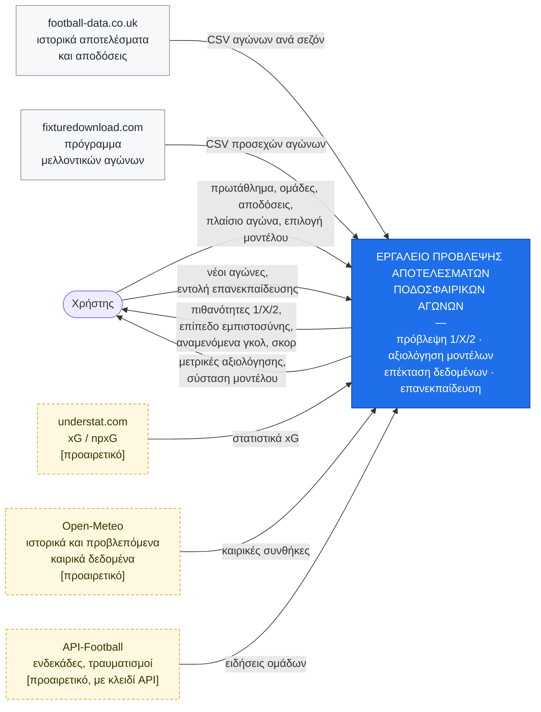
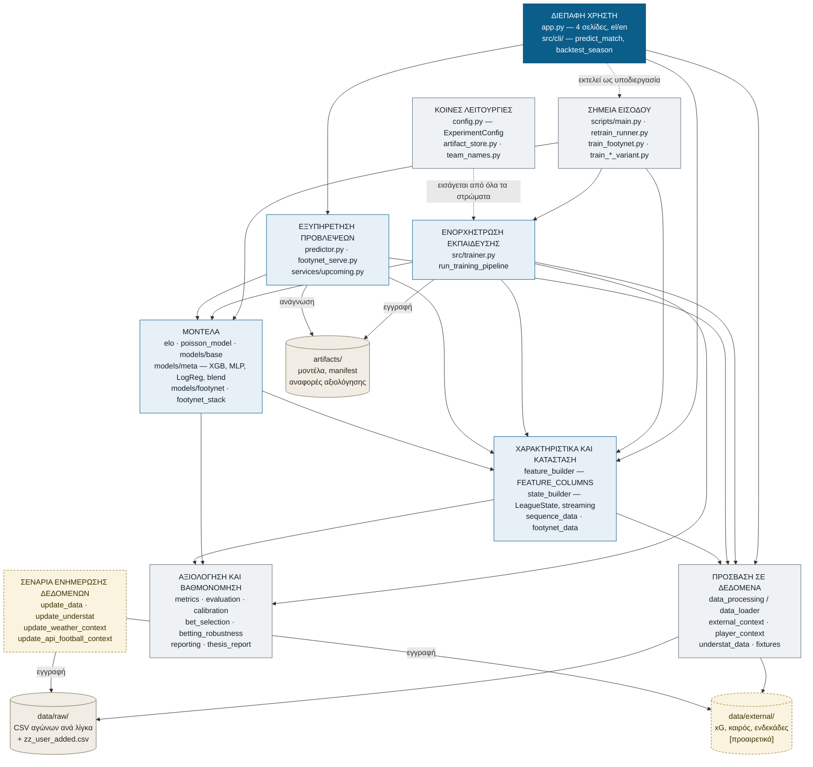
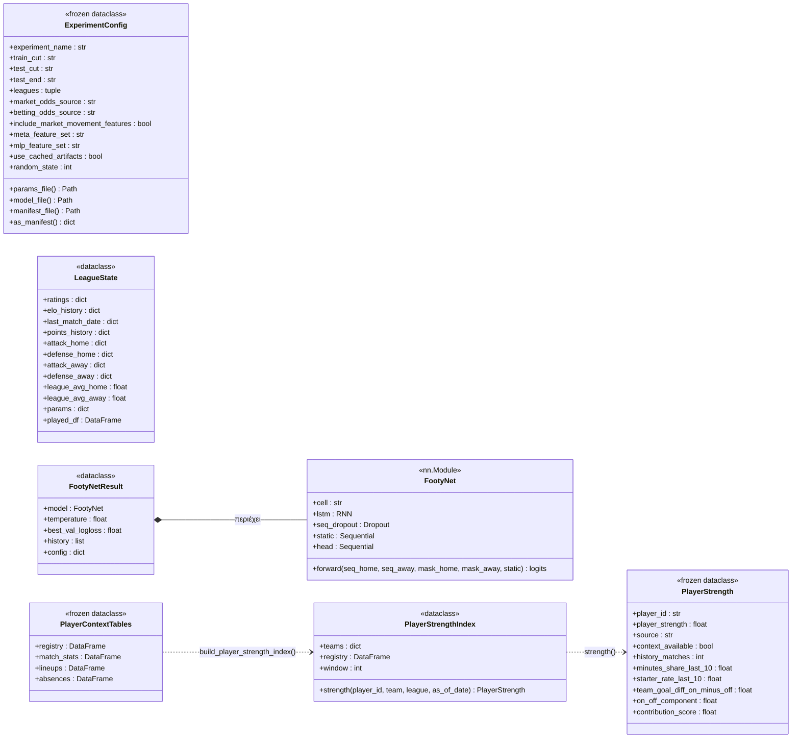
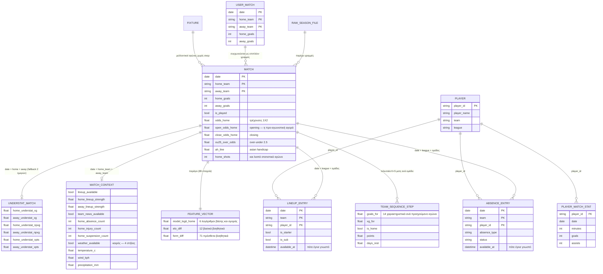
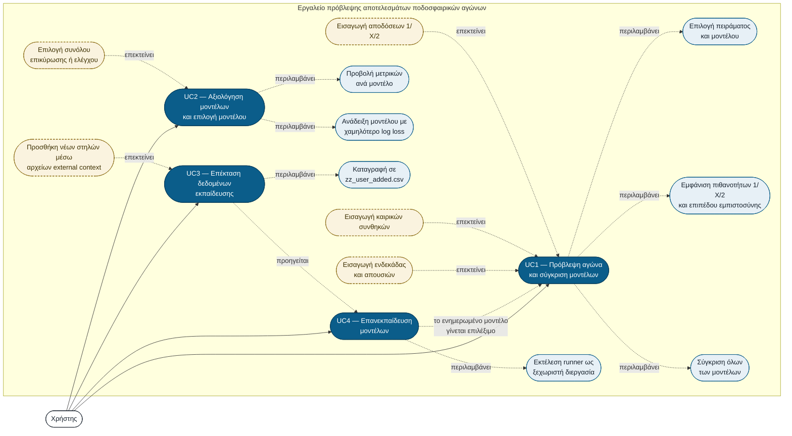
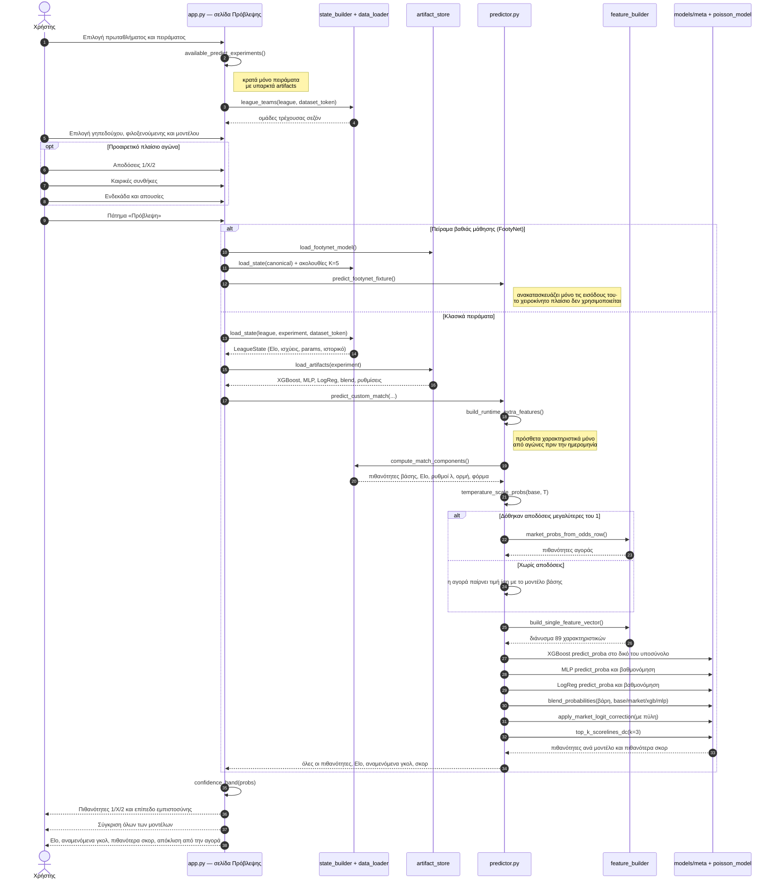
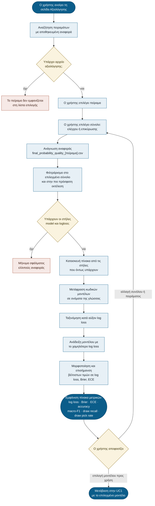
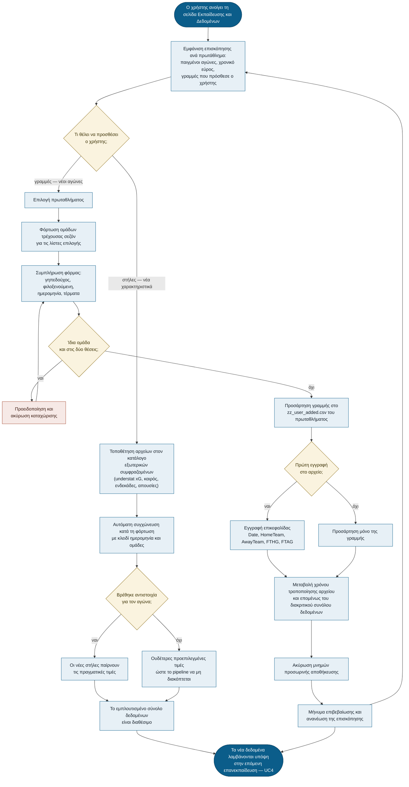
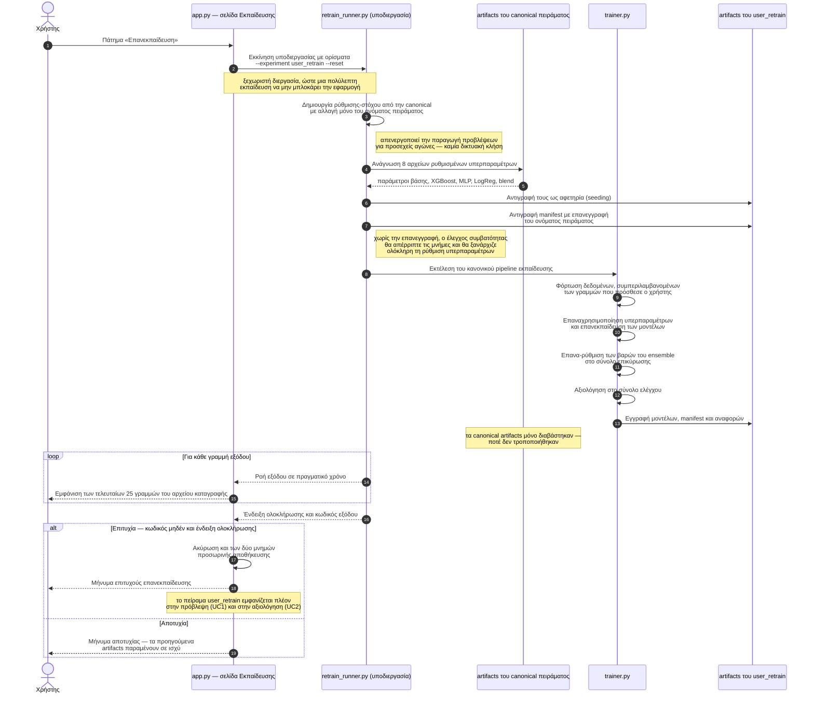

# Σχεδίαση

> Υλικό για το υποκεφάλαιο «Σχεδίαση». Περιέχει τα **8** διαγράμματα που ζητά η
> εκφώνηση: συγκειμένου (Δ1), συστατικών (Δ2), κλάσεων/ER (Δ3), περιπτώσεων
> χρήσης (Δ4) και **ένα διάγραμμα δραστηριότητας/ακολουθίας ανά περίπτωση
> χρήσης** (Δ5–Δ8 για UC1–UC4).
>
> Κάθε διάγραμμα κατασκευάζεται **αφού** επαληθευτεί από τον κώδικα, ένα κάθε
> φορά, και συνοδεύεται από τη γραμμή «Πηγή αλήθειας» με τα αρχεία στα οποία
> βασίζεται.

## Πώς συντηρούνται τα διαγράμματα

Τα διαγράμματα γράφονται σε **Mermaid**, ως πηγαίος κώδικας μέσα σε αυτό το
αρχείο. Αυτό σημαίνει ότι:

- είναι **versioned** στο git — φαίνεται τι άλλαξε και πότε, όπως στον κώδικα·
- **ανανεώνονται με επεξεργασία κειμένου**, χωρίς εργαλείο σχεδίασης·
- αποδίδονται σε εικόνα από το GitHub, το VS Code (extension Mermaid), ή το
  <https://mermaid.live> για εξαγωγή PNG/SVG προς την αναφορά.

Κάθε διάγραμμα συνοδεύεται από γραμμή **«Πηγή αλήθειας»** με τα αρχεία κώδικα από
τα οποία προέκυψε. Ο παρακάτω πίνακας είναι ο μηχανισμός συντήρησης: αν αλλάξει
κάποιο από αυτά τα αρχεία, ενημερώνονται τα αντίστοιχα διαγράμματα.

| Αν αλλάξει… | Ενημέρωσε |
|---|---|
| `src/update_data.py`, `src/update_understat.py`, `src/update_weather_context.py`, `src/update_api_football_context.py` | Δ1 (συγκειμένου) |
| `app.py` (σελίδες/ροές), `src/trainer.py`, `src/predictor.py`, `scripts/retrain_runner.py` | Δ2 (συστατικών), Δ5–Δ8 (ανά UC) |
| `src/config.py` (`ExperimentConfig`), `src/state_builder.py` (`LeagueState`), `src/models/footynet.py` | Δ3 (κλάσεων) |
| `src/data_processing.py` (σχήμα δεδομένων), `src/feature_builder.py` (`FEATURE_COLUMNS`) | Δ3 (ER/οντότητες) |
| `report/requirements.md` (FR/UC) | Δ4 (use-case) |

---

## Δ1. Διάγραμμα συγκειμένου (context)

Το διάγραμμα συγκειμένου δείχνει το σύστημα ως ένα σύνολο και προσδιορίζει τις
εξωτερικές οντότητες με τις οποίες ανταλλάσσει πληροφορία: τον χρήστη και τις
πέντε εξωτερικές πηγές δεδομένων.

**Πηγή αλήθειας:** `src/update_data.py` (football-data.co.uk, fixturedownload.com),
`src/update_understat.py`, `src/update_weather_context.py`,
`src/update_api_football_context.py`, `app.py`.

**Μέθοδος επαλήθευσης:** αναζήτηση όλων των URL στα `src/`, `scripts/`, `app.py`
(βρέθηκαν πέντε πηγές· η αναφορά στο download.pytorch.org είναι οδηγία
εγκατάστασης σε docstring, όχι εξωτερικό σύστημα) και έλεγχος ότι το `app.py` δεν
εισάγει `requests` ή `urllib`.

**Σχολιασμός.** Τρία σημεία αξίζουν προσοχή στο διάγραμμα:

1. **Ένας δρώντας.** Το σύστημα έχει έναν μόνο τύπο χρήστη, ο οποίος εκτελεί και
   τις τέσσερις περιπτώσεις χρήσης. Κύρια διεπαφή είναι η διαδραστική εφαρμογή·
   εναλλακτικά, ο ίδιος χρήστης μπορεί να καλέσει τα εργαλεία γραμμής εντολών για
   πρόβλεψη ενός αγώνα ή για οπισθοδρομικό έλεγχο μιας σεζόν.
2. **Οι διακεκομμένες πηγές είναι προαιρετικές.** Οι πηγές understat, Open-Meteo
   και API-Football εμπλουτίζουν τα δεδομένα αλλά δεν απαιτούνται: όταν λείπουν,
   τα αντίστοιχα χαρακτηριστικά παίρνουν ουδέτερες προεπιλεγμένες τιμές και το
   σύστημα λειτουργεί κανονικά. Η API-Football απαιτεί επιπλέον κλειδί πρόσβασης.

   **Ειδικά για τα καιρικά δεδομένα** (Open-Meteo) πρέπει να δηλωθεί με ακρίβεια
   το εύρος της υποστήριξης, ώστε το διάγραμμα να μην υπονοεί περισσότερα από όσα
   ισχύουν: ο μηχανισμός λήψης, συγχώνευσης και εισαγωγής από τον χρήστη υπάρχει
   και λειτουργεί (θερμοκρασία, άνεμος, υετός), αλλά **κανένα από τα σύνολα
   χαρακτηριστικών που σερβίρονται δεν περιλαμβάνει καιρικά χαρακτηριστικά** — το
   canonical πείραμα καταλήγει σε σύνολο βασισμένο στην αγορά, και οι παραλλαγές
   χρησιμοποιούν understat xG ή ισχύ ενδεκάδας. Επομένως η καιρική είσοδος
   καλύπτει την απαίτηση της εκφώνησης αλλά **στην πράξη δεν μεταβάλλει την
   πρόβλεψη**. Η πληρέστερη ενσωμάτωση του καιρού στη λογική των μοντέλων
   **κρίθηκε μη βιώσιμη στο παρόν στάδιο**: θα απαιτούσε ιστορικά καιρικά
   δεδομένα ανά γήπεδο και ώρα έναρξης για ~25.000 αγώνες, μαζί με νέο
   εκπαιδευμένο πείραμα, με αμφίβολο όφελος δεδομένου ότι τα ablations δεν
   έδειξαν βελτίωση έναντι της αγοράς. Καταγράφεται ως μελλοντική εργασία και
   αιτιολογείται αντίστοιχα στον πίνακα «Βαθμός Ικανοποίησης Απαιτήσεων» (FR2).
3. **Το σύστημα λειτουργεί εξ ολοκλήρου εκτός σύνδεσης.** Η επικοινωνία με τις
   εξωτερικές πηγές γίνεται **μόνο** από τα ξεχωριστά σενάρια ενημέρωσης
   δεδομένων, τα οποία εκτελούνται κατά βούληση. Η διαδραστική εφαρμογή δεν
   πραγματοποιεί καμία δικτυακή κλήση — επαληθεύτηκε ότι το `app.py` δεν εισάγει
   ούτε χρησιμοποιεί βιβλιοθήκη δικτύου — και το αποθετήριο συνοδεύεται από
   στιγμιότυπο των ιστορικών δεδομένων, ώστε η πρόβλεψη και η αξιολόγηση να είναι
   δυνατές χωρίς πρόσβαση στο διαδίκτυο.

---

## Δ2. Διάγραμμα συστατικών (component)

Το διάγραμμα συστατικών αναλύει το εσωτερικό του συστήματος σε λογικά συστατικά
και δείχνει τις εξαρτήσεις μεταξύ τους. Τα συστατικά και οι εξαρτήσεις **δεν
σχεδιάστηκαν με βάση την εντύπωση**: προέκυψαν από τον πραγματικό γράφο εισαγωγών
(imports) του κώδικα, ο οποίος εξάγεται αυτόματα με το εργαλείο
`report/tools/import_graph.py`.

**Πηγή αλήθειας:** ο γράφος εισαγωγών όπως εξάγεται από
`report/tools/import_graph.py` (35 λειτουργικές μονάδες σε `src/`, `scripts/`,
`app.py`), και ο έλεγχος υποδιεργασίας στο `app.py`.

**Σχολιασμός.** Το διάγραμμα αναδεικνύει έξι στοιχεία της αρχιτεκτονικής:

1. **Ροή εξαρτήσεων προς μία κατεύθυνση.** Οι εξαρτήσεις κατευθύνονται πάντα από
   τα ανώτερα προς τα κατώτερα στρώματα: η διεπαφή εξαρτάται από την εξυπηρέτηση,
   η εξυπηρέτηση από τα μοντέλα και τα χαρακτηριστικά, τα χαρακτηριστικά από την
   πρόσβαση στα δεδομένα. Δεν υπάρχει κυκλική εξάρτηση μεταξύ των στρωμάτων, κάτι
   που επιτρέπει να αντικατασταθεί ή να επεκταθεί ένα στρώμα χωρίς αλλαγές στα
   υπόλοιπα.
2. **Ένα κοινό στρώμα υποδομής.** Τα «Κοινές λειτουργίες» εισάγονται από όλα τα
   στρώματα και για λόγους αναγνωσιμότητας δεν σχεδιάζονται όλες οι ακμές τους.
   Συγκεκριμένα, το `config.py` (που περιέχει το `ExperimentConfig`) εισάγεται από
   **16** λειτουργικές μονάδες, το `calibration.py` από **9**, το
   `feature_builder.py` από **8**, το `team_names.py` από **7** και το
   `artifact_store.py` από **5** — αριθμοί που προκύπτουν από την ανάλυση
   fan-in του εργαλείου. Το γεγονός ότι το `ExperimentConfig` είναι η πλέον
   διαδεδομένη εξάρτηση αποτυπώνει τη θεμελιώδη σχεδιαστική απόφαση: κάθε
   συμπεριφορά του συστήματος οδηγείται από τη ρύθμιση του πειράματος.
3. **Η επανεκπαίδευση εκτελείται ως ξεχωριστή διεργασία.** Η διεπαφή δεν καλεί το
   pipeline εκπαίδευσης μέσα στη διεργασία της, αλλά **εκκινεί τον runner ως
   υποδιεργασία** (διακεκομμένη ακμή). Έτσι μια πολύλεπτη επανεκπαίδευση δεν
   μπλοκάρει ούτε αποσταθεροποιεί την εφαρμογή, και η έξοδός της μπορεί να
   παρακολουθείται σε πραγματικό χρόνο.
4. **Διακριτός δίαυλος ανάγνωσης και εγγραφής των artifacts.** Η ενορχήστρωση
   **γράφει** στα artifacts, η εξυπηρέτηση μόνο **διαβάζει**. Επειδή κάθε
   διαδρομή αρχείου παράγεται από το όνομα του πειράματος, δύο πειράματα δεν
   μπορούν να αλληλοεπικαλυφθούν — και η επανεκπαίδευση του χρήστη γράφει σε
   δικό της πείραμα, αφήνοντας άθικτα τα αποτελέσματα που τεκμηριώνει η αναφορά.
5. **Τα σενάρια ενημέρωσης είναι αποσυνδεδεμένα.** Αποτελούν χωριστό, προαιρετικό
   συστατικό που γράφει στις αποθήκες δεδομένων και δεν καλείται ποτέ από την
   εφαρμογή — εξ ου και η δυνατότητα λειτουργίας εκτός σύνδεσης (Δ1).
6. **Η βαθιά μάθηση είναι παράλληλη διαδρομή.** Το `train_footynet.py` δεν περνά
   από την κύρια ενορχήστρωση: εξαρτάται απευθείας από τα μοντέλα και τα
   χαρακτηριστικά ακολουθιών (`sequence_data`, `footynet_data`), γι' αυτό η ακμή
   από τα «Σημεία εισόδου» καταλήγει και στα δύο αυτά συστατικά. Η βιβλιοθήκη
   PyTorch εισάγεται καθυστερημένα (lazy import), ώστε το υπόλοιπο σύστημα να
   λειτουργεί χωρίς αυτήν.

---

## Δ3. Διάγραμμα κλάσεων και οντοτήτων (class / ER)

Το σύστημα είναι δεδομενοκεντρικό: η λογική του δεν εκφράζεται μέσα από βαθιά
ιεραρχία κλάσεων αλλά μέσα από λίγες, καλά ορισμένες δομές δεδομένων και ένα
σταθερό σχήμα δεδομένων. Για τον λόγο αυτό το διάγραμμα δίνεται σε δύο μέρη: οι
**κλάσεις** που φέρουν την κατάσταση του συστήματος (Δ3α) και οι **οντότητες
δεδομένων** με τα κλειδιά σύνδεσής τους (Δ3β).

### Δ3α. Κλάσεις

**Πηγή αλήθειας:** `src/config.py:ExperimentConfig`,
`src/state_builder.py:LeagueState`, `src/models/footynet.py:FootyNet` και
`FootyNetResult`, `src/player_context.py:PlayerContextTables` / `PlayerStrength` /
`PlayerStrengthIndex`. Η όγδοη κλάση του έργου, `ApiFootballClient`
(`src/update_api_football_context.py`), είναι πελάτης HTTP του προαιρετικού
updater και δεν ανήκει στο μοντέλο πεδίου, γι' αυτό δεν εμφανίζεται.

**Σχολιασμός.**

1. **`ExperimentConfig` — αμετάβλητη ρύθμιση ως ραχοκοκαλιά.** Είναι
   `frozen dataclass` με **27 πεδία** και **22 παράγωγες διαδρομές αρχείων**. Η
   αμεταβλητότητα δεν είναι διακοσμητική: εγγυάται ότι η ρύθμιση δεν μπορεί να
   αλλάξει στη μέση μιας εκτέλεσης, οπότε το manifest που γράφεται μαζί με τα
   artifacts περιγράφει πράγματι το πείραμα που έτρεξε. Επειδή κάθε διαδρομή
   παράγεται από το `experiment_name` (π.χ.
   `artifacts/best_params_final_opening_market_pre_match.json`), δύο πειράματα
   είναι αδύνατο να αλληλοεπικαλυφθούν — αυτό είναι ο μηχανισμός που κρατά άθικτα
   τα canonical αποτελέσματα όταν ο χρήστης επανεκπαιδεύει. Το έργο διαθέτει
   **έξι** έτοιμες ρυθμίσεις (canonical, context-aware, player-context, FootyNet
   και δύο παλαιότερες βάσεις), συν την `user_retrain` που δημιουργεί η εφαρμογή.
2. **`LeagueState` — το στιγμιότυπο που καθιστά δυνατή την πρόβλεψη.**
   Συγκεντρώνει ό,τι χρειάζεται για να βαθμολογηθεί ένας νέος αγώνας: βαθμολογίες
   Elo και ιστορικό τους, επιθετικές/αμυντικές ισχύεις χωριστά για εντός και εκτός
   έδρας, τους μέσους ρυθμούς σκοραρίσματος του πρωταθλήματος, τις ρυθμισμένες
   παραμέτρους του μοντέλου βάσης, και προαιρετικά το `played_df` — το ιστορικό
   παιγμένων αγώνων. Το τελευταίο είναι ο λόγος που η **ίδια** διαδικασία
   κατασκευής χαρακτηριστικών χρησιμοποιείται σε εκπαίδευση και σε εξυπηρέτηση,
   κάτι που αποκλείει την ασυμφωνία train/serve.
3. **`FootyNet` — όψιμη σύντηξη στην ίδια τη δομή της κλάσης.** Οι τρεις κλάδοι
   είναι ορατοί ως πεδία: ο κοινός αναδρομικός κωδικοποιητής (`lstm`, με κοινά
   βάρη για τις δύο ομάδες), ο στατικός κλάδος (`static`) και η κεφαλή σύντηξης
   (`head`). Η `forward` συνενώνει `[h_home, h_away, |h_home − h_away|, h_static]`
   — η απόλυτη διαφορά είναι ρητή αναπαράσταση της *ανισότητας ισχύος* των δύο
   ομάδων. Το πεδίο διατηρεί το όνομα `lstm` ακόμη και όταν επιλεγεί κύτταρο GRU,
   ώστε τα αποθηκευμένα checkpoints να παραμένουν συμβατά.
4. **`FootyNetResult` — το μοντέλο δεν ταξιδεύει ποτέ χωρίς τη βαθμονόμησή του.**
   Η θερμοκρασία αποθηκεύεται μαζί με το δίκτυο, ώστε να είναι αδύνατο να σερβιριστεί
   αβαθμονόμητο μοντέλο.
5. **Το πλαίσιο παικτών είναι σχεδιασμένο για ταχύτητα και για ασφάλεια από
   διαρροή.** Ο `PlayerStrengthIndex` κατασκευάζεται μία φορά και προ-κανονικοποιεί
   τα δεδομένα ανά (πρωτάθλημα, ομάδα), ώστε κάθε κλήση `strength()` να τεμαχίζει
   ένα μικρό πλαίσιο αντί να διατρέχει ολόκληρο τον πίνακα. Η υπογραφή της
   `strength()` απαιτεί υποχρεωτικά `as_of_date`: η ισχύς ενός παίκτη υπολογίζεται
   πάντα «ως προς μια ημερομηνία», που είναι ο τρόπος με τον οποίο ο κανόνας μη
   διαρροής επιβάλλεται στη διεπαφή της ίδιας της κλάσης.

### Δ3β. Οντότητες δεδομένων και κλειδιά σύνδεσης

**Πηγή αλήθειας:** `src/data_processing.py` (κανονικό σχήμα αγώνα και κλειδιά
συγχώνευσης), `src/understat_data.py:UNDERSTAT_VALUE_COLUMNS` και
`add_understat_xg`, `src/external_context.py:EXTERNAL_CONTEXT_VALUE_COLUMNS`,
`src/player_context.py` (τα τέσσερα σχήματα CSV),
`src/feature_builder.py:FEATURE_COLUMNS`, `src/sequence_data.py:TEAM_MATCH_FEATURES`.

**Σχολιασμός.**

1. **Ένα σύνθετο κλειδί για τα πάντα.** Η ταυτότητα ενός αγώνα είναι η τριάδα
   (ημερομηνία, γηπεδούχος, φιλοξενούμενη). Πάνω σε αυτή γίνονται όλες οι
   συγχωνεύσεις και η αφαίρεση διπλοτύπων — γι' αυτό η **κανονικοποίηση των
   ονομάτων ομάδων** (`team_names.py`, που εισάγεται από 7 μονάδες) είναι κρίσιμη:
   διαφορετικές πηγές γράφουν διαφορετικά την ίδια ομάδα.
2. **Οι προαιρετικές οντότητες συνδέονται με πληθικότητα μηδέν-ή-ένα.** Τα
   understat και τα εξωτερικά συμφραζόμενα είναι `||--o|`: ένας αγώνας *μπορεί* να
   μην έχει αντίστοιχη εγγραφή, και τότε τα χαρακτηριστικά παίρνουν ουδέτερες
   τιμές. Η σύνδεση με το understat διαθέτει και εφεδρική αντιστοίχιση ανοχής δύο
   ημερών, επειδή οι πηγές διαφωνούν περιστασιακά στην ημερομηνία διεξαγωγής.
3. **Οι εγγραφές του χρήστη είναι χωριστή οντότητα με ίδιο κλειδί.** Το
   `zz_user_added.csv` έχει το σχήμα του αγώνα και συγχωνεύεται ως επιπλέον
   γραμμές, χωρίς να τροποποιείται κανένα αρχείο πηγής — η αρχή ότι οι ενέργειες
   του χρήστη δεν αλλοιώνουν τα δεδομένα της εργασίας αποτυπώνεται στο ίδιο το
   σχήμα.
4. **Το `available_at` είναι το χρονόσημο που προστατεύει από διαρροή.** Οι
   εγγραφές ενδεκάδων και απουσιών καταγράφουν *πότε έγινε γνωστή* η πληροφορία,
   ώστε να μην χρησιμοποιηθεί ποτέ πληροφορία που δημοσιεύθηκε μετά την έναρξη.
5. **Το διάνυσμα χαρακτηριστικών είναι παράγωγο, όχι αποθηκευμένο.** Αποτελείται
   από **89 στοιχεία** σε τρία μπλοκ — 6 λογάριθμοι βάσης και αγοράς, 12 βασικά
   βοηθητικά (Elo, ρυθμοί Poisson, ορμή, ξεκούραση, φόρμα) και 71 πρόσθετα
   (κυλιόμενη φόρμα, understat, μεταβολή αγοράς, ενδεκάδες/απουσίες/καιρός) — και
   ανακατασκευάζεται πάντα από αγώνες προγενέστερους της ημερομηνίας του
   αγώνα-στόχου. Η σειρά των στοιχείων είναι σημαντική σε όλη τη διαδρομή, γι'
   αυτό ο κατάλογος `FEATURE_COLUMNS` είναι η μοναδική πηγή αλήθειας και
   επαληθεύεται με unit tests.
6. **Οι ακολουθίες του FootyNet είναι ξεχωριστή αναπαράσταση.** Για κάθε αγώνα
   κατασκευάζονται δύο ακολουθίες των **K = 5** τελευταίων αγώνων (μία ανά ομάδα),
   με **14 χαρακτηριστικά** ανά προηγούμενο αγώνα, από τη σκοπιά της κάθε ομάδας.
   Πρόκειται για διαφορετική όψη των ίδιων δεδομένων: αντί για συνόψεις που
   επιλέγει ο μηχανικός, δίνεται στο δίκτυο η ίδια η χρονοσειρά.

---

## Δ4. Διάγραμμα περιπτώσεων χρήσης (use-case)

Οι τέσσερις περιπτώσεις χρήσης του συστήματος αντιστοιχούν στις τέσσερις σελίδες
της εφαρμογής. Το διάγραμμα δείχνει, μαζί με τις κύριες περιπτώσεις, και τις
σχέσεις **«περιλαμβάνει»** (υποχρεωτικά βήματα) και **«επεκτείνει»**
(προαιρετικές ενέργειες του χρήστη), ώστε να φαίνεται ποια είσοδος είναι
απαραίτητη και ποια όχι.

**Πηγή αλήθειας:** `app.py` — οι τέσσερις σελίδες (`page_predict`,
`page_evaluation`, `page_train`, `page_about`), οι βοηθητικές
`confidence_band()`, `weather_controls()`, `player_context_controls()`,
`append_user_match()`, `available_predict_experiments()`, το `MODEL_LABELS` και το
`PREDICT_EXPERIMENTS`· `report/requirements.md` §3 για την αντιστοίχιση UC → FR.

### Αντιστοίχιση περιπτώσεων χρήσης, απαιτήσεων και σελίδων

| UC | Τίτλος | Απαιτήσεις | Σελίδα εφαρμογής |
|---|---|---|---|
| UC1 | Πρόβλεψη αγώνα με προαιρετικό πλαίσιο και σύγκριση μοντέλων | FR1–FR7, FR12 | Πρόβλεψη Αγώνα |
| UC2 | Αξιολόγηση μοντέλων και επιλογή μοντέλου προς χρήση | FR5–FR9 | Αξιολόγηση Μοντέλων |
| UC3 | Επέκταση δεδομένων εκπαίδευσης (γραμμές / στήλες) | FR11 | Εκπαίδευση – Δεδομένα |
| UC4 | Επανεκπαίδευση και χρήση του ενημερωμένου μοντέλου | FR10, FR3 | Εκπαίδευση – Δεδομένα → Πρόβλεψη |

Η απαίτηση FR13 (δίγλωσση διεπαφή) δεν αποτελεί χωριστή περίπτωση χρήσης: η
επιλογή γλώσσας είναι διαθέσιμη από την πλαϊνή στήλη σε **όλες** τις σελίδες και
επομένως διαπερνά τις τέσσερις περιπτώσεις.

**Σχολιασμός.**

1. **Οι προαιρετικές είσοδοι είναι σχέσεις «επεκτείνει», όχι «περιλαμβάνει».** Ο
   χρήστης μπορεί να ζητήσει πρόβλεψη δίνοντας μόνο πρωτάθλημα και τις δύο ομάδες.
   Οι αποδόσεις, οι καιρικές συνθήκες και η ενδεκάδα είναι προαιρετικές
   επεκτάσεις — το διάγραμμα το αποτυπώνει με διακεκομμένα περιγράμματα, σε
   συμφωνία με τους ουδέτερους μηχανισμούς εφεδρείας του Δ1. Ειδικά για τις
   καιρικές συνθήκες ισχύει ο περιορισμός που τεκμηριώθηκε στο Δ1: γίνονται δεκτές
   ως είσοδος αλλά δεν συμμετέχουν σε κανένα σερβιριζόμενο σύνολο χαρακτηριστικών.
2. **Η επέκταση με νέες στήλες δεν γίνεται από τη διεπαφή.** Οι *γραμμές* (νέοι
   αγώνες) προστίθενται μέσα από την εφαρμογή· οι *στήλες* προστίθενται
   τοποθετώντας αρχεία στον κατάλογο external context, τα οποία συγχωνεύονται
   αυτόματα. Επαληθεύτηκε ότι η εφαρμογή δεν διαθέτει στοιχείο ανεβάσματος
   αρχείων, οπότε η σχέση σχεδιάζεται ως εξωτερική επέκταση της UC3 και
   αιτιολογείται αντίστοιχα στον πίνακα «Βαθμός Ικανοποίησης Απαιτήσεων» (FR11).
3. **Η UC4 κλείνει τον κύκλο προς την UC1.** Η εκφώνηση απαιτεί ο χρήστης «να
   επανεκπαιδεύει τα υπάρχοντα μοντέλα ώστε να προχωρά στην κατάλληλη ενημέρωσή
   τους» — δηλαδή το ενημερωμένο μοντέλο πρέπει να είναι *χρησιμοποιήσιμο*. Γι'
   αυτό υπάρχει η ακμή από την UC4 προς την UC1: μετά την επανεκπαίδευση το
   πείραμα `user_retrain` εμφανίζεται στη λίστα επιλογής της σελίδας πρόβλεψης,
   επειδή ο έλεγχος διαθεσιμότητας βασίζεται στην ύπαρξη των artifacts του.
4. **Η UC3 προηγείται λογικά της UC4, χωρίς να είναι υποχρεωτική.** Η
   επανεκπαίδευση έχει νόημα και χωρίς νέα δεδομένα (π.χ. μετά από ανανέωση των
   αποτελεσμάτων), γι' αυτό η σχέση σημειώνεται ως «προηγείται» και όχι ως
   «περιλαμβάνει».
5. **Η UC2 υπηρετεί ρητά την επιλογή μοντέλου.** Δεν παρουσιάζει απλώς μετρικές:
   αναδεικνύει το μοντέλο με το χαμηλότερο log loss και επιτρέπει την εναλλαγή
   μεταξύ συνόλου επικύρωσης και συνόλου ελέγχου — ώστε ο χρήστης να βλέπει ότι η
   επιλογή έγινε στο validation και το test παραμένει ανεξάρτητη επιβεβαίωση.
6. **Πλήθος επιλογών που εκτίθενται στην UC1.** Ορίζονται **9** μοντέλα: επτά
   διαθέσιμα στα κλασικά πειράματα (βάση, αγορά, διορθωμένη αγορά, XGBoost,
   Logistic Regression, MLP, ensemble) και τέσσερα στο πείραμα βαθιάς μάθησης
   (FootyNet, FootyNet+αγορά, βάση, αγορά — τα δύο τελευταία κοινά). Τα
   ρυθμισμένα πειράματα είναι **5**, από τα οποία **3** είναι διαθέσιμα με τα
   παραδοτέα artifacts· το `player_context_aware` απαιτεί προηγούμενη εκπαίδευση
   και το `user_retrain` εμφανίζεται μόνο αφού ο χρήστης εκτελέσει επανεκπαίδευση.

---

## Δ5. Διάγραμμα ακολουθίας — UC1: Πρόβλεψη αγώνα

Η περίπτωση χρήσης UC1 είναι η πιο σύνθετη του συστήματος, γιατί σε μία ενέργεια
του χρήστη ανακατασκευάζονται τα χαρακτηριστικά του αγώνα και εκτελούνται
*όλα* τα μοντέλα ώστε να είναι συγκρίσιμα. Η ακολουθία που ακολουθεί είναι η
πραγματική σειρά κλήσεων του κώδικα.

**Πηγή αλήθειας:** `app.py:page_predict()` και `run_prediction()`,
`src/predictor.py:predict_custom_match()` και `build_runtime_extra_features()`,
`src/state_builder.py:compute_match_components()`,
`src/feature_builder.py:build_single_feature_vector()` / `market_probs_from_odds_row()`,
`src/models/meta.py:blend_probabilities()` / `apply_market_logit_correction()`,
`src/poisson_model.py:top_k_scorelines_dc()`, `src/footynet_serve.py`.

**Σχολιασμός.**

1. **Όλα τα μοντέλα εκτελούνται σε κάθε πρόβλεψη.** Ο χρήστης επιλέγει ποιο
   *βλέπει* ως κύριο, αλλά η επιστροφή περιέχει τις πιθανότητες όλων. Αυτό είναι
   συνειδητή σχεδιαστική επιλογή που εξυπηρετεί την απαίτηση σύγκρισης μοντέλων:
   ο χρήστης μπορεί να αντιπαραβάλει τα μοντέλα στον *ίδιο* αγώνα, χωρίς
   επανυπολογισμό.
2. **Η βαθμονόμηση εφαρμόζεται πριν από κάθε χρήση των πιθανοτήτων.** Το μοντέλο
   βάσης βαθμονομείται με τη θερμοκρασία που είναι αποθηκευμένη στις παραμέτρους
   της κατάστασης, και τα MLP/LogReg με τη δική τους. Οι βαθμονομημένες — και όχι
   οι ωμές — πιθανότητες τροφοδοτούν το διάνυσμα χαρακτηριστικών και το ensemble,
   ώστε το δηλωμένο επίπεδο εμπιστοσύνης να είναι συγκρίσιμο μεταξύ μοντέλων.
3. **Η απουσία αποδόσεων αντιμετωπίζεται ρητά.** Αν ο χρήστης δεν δώσει αποδόσεις
   (τιμές μικρότερες ή ίσες του 1 θεωρούνται «καμία αγορά»), η «αγορά» παίρνει την
   τιμή του βαθμονομημένου μοντέλου βάσης. Αυτό διατηρεί τη διαστασιολογία του
   διανύσματος χαρακτηριστικών, αλλά σημαίνει ότι τα μοντέλα που εξαρτώνται από
   την αγορά χάνουν την πληροφορία τους — γι' αυτό η διεπαφή εμφανίζει ενημερωτικό
   μήνυμα όταν επιλεγεί μοντέλο εξαρτώμενο από την αγορά χωρίς αποδόσεις.
4. **Κάθε μοντέλο χρησιμοποιεί το δικό του υποσύνολο χαρακτηριστικών.** Το
   διάνυσμα των 89 στοιχείων κατασκευάζεται μία φορά, και κάθε μοντέλο επιλέγει
   από αυτό τις στήλες που αποθηκεύτηκαν κατά την εκπαίδευση, μέσω αντιστοίχισης
   ονομάτων σε θέσεις. Έτσι είναι αδύνατο ένα μοντέλο να δεχθεί χαρακτηριστικά σε
   λάθος σειρά — ο κίνδυνος που ελέγχεται ρητά από τα unit tests ευθυγράμμισης.
5. **Ο κανόνας μη διαρροής ισχύει και στην εξυπηρέτηση.** Τα πρόσθετα
   χαρακτηριστικά ανακατασκευάζονται από το ιστορικό παιγμένων αγώνων που φέρει η
   κατάσταση, με τον ίδιο κανόνα «μόνο προγενέστερα του αγώνα» που εφαρμόζεται
   στην εκπαίδευση. Η διαδικασία είναι κοινή, οπότε δεν μπορεί να προκύψει
   ασυμφωνία μεταξύ εκπαίδευσης και εξυπηρέτησης.
6. **Η διαδρομή του FootyNet είναι χωριστή και το δηλώνει.** Το βαθύ μοντέλο
   ανακατασκευάζει μόνο του τις εισόδους του (ακολουθίες K = 5 ανά ομάδα και
   στατικό διάνυσμα) και αντλεί την κατάσταση από το canonical πείραμα· το
   χειροκίνητο πλαίσιο του χρήστη δεν συμμετέχει. Η διεπαφή περιορίζει αντίστοιχα
   τα διαθέσιμα μοντέλα σε τέσσερα, ώστε να μην εμφανίζονται έξοδοι που το πείραμα
   δεν παράγει.
7. **Οι μνήμες προσωρινής αποθήκευσης κλειδώνονται στο σύνολο δεδομένων.** Η
   φόρτωση κατάστασης και artifacts είναι προσωρινά αποθηκευμένη, αλλά το κλειδί
   περιλαμβάνει ένα διακριτικό του συνόλου δεδομένων· έτσι, μόλις ο χρήστης
   προσθέσει αγώνες ή επανεκπαιδεύσει, η επόμενη πρόβλεψη χρησιμοποιεί
   αναγκαστικά τα φρέσκα δεδομένα (σύνδεση με UC3 και UC4).

---

## Δ6. Διάγραμμα δραστηριότητας — UC2: Αξιολόγηση και επιλογή μοντέλου

Η UC2 δεν εκτελεί μοντέλα: **διαβάζει** τις αναφορές αξιολόγησης που παρήγαγε το
pipeline και τις παρουσιάζει ώστε ο χρήστης να επιλέξει μοντέλο. Ο διαχωρισμός
είναι ουσιώδης — η αξιολόγηση δεν επαναλαμβάνεται κατά την προβολή, οπότε τα
νούμερα που βλέπει ο χρήστης είναι *ακριβώς* εκείνα των παραδοτέων artifacts.

**Πηγή αλήθειας:** `app.py:page_evaluation()`, `list_eval_experiments()`,
`load_latest_eval()`, `eval_file()`, `EVAL_COLUMNS`, `MODEL_LABELS`· οι αναφορές
`artifacts/final_probability_quality_*.csv` που γράφει το
`src/trainer.py`.

**Σχολιασμός.**

1. **Η αξιολόγηση διαχωρίζεται πλήρως από την προβολή.** Τα μοντέλα αξιολογούνται
   μία φορά, κατά την εκπαίδευση, και τα αποτελέσματα αποθηκεύονται. Η σελίδα
   απλώς διαβάζει το αρχείο. Έτσι διασφαλίζεται ότι οι μετρικές που παρουσιάζονται
   στον χρήστη — και τα στιγμιότυπα οθόνης της αναφοράς — αντιστοιχούν στα ίδια
   artifacts που τεκμηριώνουν τα αποτελέσματα, χωρίς κίνδυνο να διαφέρουν λόγω
   επανυπολογισμού.
2. **Η επιλογή συνόλου καθιστά ορατή τη μεθοδολογία.** Ο χρήστης εναλλάσσει μεταξύ
   συνόλου **επικύρωσης** και συνόλου **ελέγχου**. Αυτό δεν είναι διακοσμητικό:
   κάθε ρύθμιση που «κέρδισε» (υποσύνολα χαρακτηριστικών, βάρη ensemble, πύλη
   διόρθωσης αγοράς) επιλέχθηκε στο σύνολο επικύρωσης, οπότε η εναλλαγή επιτρέπει
   στον χρήστη να δει ο ίδιος ότι το σύνολο ελέγχου παραμένει ανεξάρτητη
   επιβεβαίωση και όχι κριτήριο επιλογής.
3. **Η ανάδειξη του καλύτερου μοντέλου γίνεται με log loss, όχι με accuracy.** Ο
   πίνακας ταξινομείται κατά αύξον log loss και το πρώτο μοντέλο αναδεικνύεται
   ρητά, ενώ επισημαίνονται οι βέλτιστες τιμές σε log loss, Brier και ECE. Η
   επιλογή της μετρικής αντανακλά τη θέση της εργασίας: κρίνεται η ποιότητα των
   *πιθανοτήτων* και όχι η ευστοχία της κορυφαίας ετικέτας.
4. **Οι στήλες `draw recall` και `draw pick rate` εκτίθενται σκόπιμα.** Καθιστούν
   ορατό το εύρημα ότι η ισοπαλία σπάνια είναι το επικρατέστερο αποτέλεσμα: ο
   χρήστης βλέπει ότι το μοντέλο σχεδόν ποτέ δεν «διαλέγει» ισοπαλία, χωρίς αυτό
   να συνιστά κακή βαθμονόμηση. Είναι ο διαφανής τρόπος να παρουσιαστεί ένα
   δύσκολο εύρημα.
5. **Η προβολή είναι ανθεκτική σε παλαιότερες αναφορές.** Ο πίνακας κατασκευάζεται
   από τις στήλες που *υπάρχουν* στο αρχείο, με απαραίτητο ελάχιστο το όνομα του
   μοντέλου και το log loss. Αναφορές με λιτότερο σχήμα εμφανίζονται κανονικά αντί
   να προκαλέσουν σφάλμα — σημαντικό όταν συγκρίνεται μια παλαιότερη εκτέλεση με
   μια πρόσφατη.
6. **Μόνο τα πειράματα με αποθηκευμένη αναφορά εμφανίζονται.** Ο κατάλογος
   φιλτράρεται με βάση την ύπαρξη του αρχείου αξιολόγησης, οπότε η λίστα δεν
   περιέχει ποτέ επιλογή που θα αποτύγχανε. Με τα παραδοτέα artifacts εμφανίζονται
   τρία πειράματα (canonical, feature-rich, FootyNet), και το `user_retrain`
   προστίθεται αυτόματα μόλις ο χρήστης επανεκπαιδεύσει — γεγονός που συνδέει την
   UC2 με την UC4.

---

## Δ7. Διάγραμμα δραστηριότητας — UC3: Επέκταση δεδομένων εκπαίδευσης

Η εκφώνηση ζητά τη δυνατότητα επέκτασης του συνόλου δεδομένων «με την παροχή
επιπλέον γραμμών ή ακόμη και νέων στηλών». Το σύστημα υποστηρίζει και τα δύο, με
**διαφορετικό μηχανισμό** για καθένα: οι γραμμές μέσα από τη διεπαφή, οι στήλες
μέσω αρχείων εξωτερικών συμφραζομένων. Το διάγραμμα δείχνει και τις δύο διαδρομές.

**Πηγή αλήθειας:** `app.py:page_train()` (πρώτο τμήμα), `append_user_match()`,
`user_file()`, `_dataset_token()`, `dataset_summary()`, `league_teams()`·
`src/data_processing.py:load_league_data()` με `REQUIRED_BASE` και τη σάρωση
`glob("*.csv")`· `src/external_context.py`, `src/understat_data.py` για τη
συγχώνευση στηλών.

**Σχολιασμός.**

1. **Η συγχώνευση των γραμμών του χρήστη γίνεται εξ ολοκλήρου με σύμβαση.** Ο
   φορτωτής δεν αναφέρει πουθενά το αρχείο του χρήστη: σαρώνει *όλα* τα αρχεία CSV
   του καταλόγου του πρωταθλήματος και επεξεργάζεται καθένα που διαθέτει τις πέντε
   υποχρεωτικές στήλες. Το αρχείο του χρήστη γράφεται με **ακριβώς** αυτές τις
   πέντε στήλες (ημερομηνία, δύο ομάδες, δύο σκορ), οπότε αναγνωρίζεται αυτόματα.
   Το πρόθεμα «zz» στο όνομα εξασφαλίζει ότι κατά την αλφαβητική σάρωση το αρχείο
   έρχεται τελευταίο. Το σχέδιο αυτό είναι κομψό — δεν απαιτεί ειδική περίπτωση
   στον κώδικα — αλλά είναι **έμμεσο**, και γι' αυτό τεκμηριώνεται ρητά εδώ.
2. **Κανένα αρχείο πηγής δεν τροποποιείται ποτέ.** Η προσθήκη γίνεται σε
   ξεχωριστό αρχείο ανά πρωτάθλημα, σε λειτουργία προσάρτησης. Η αρχή ότι οι
   ενέργειες του χρήστη δεν αλλοιώνουν τα δεδομένα που τεκμηριώνει η εργασία
   υλοποιείται στον ίδιο τον μηχανισμό εγγραφής και όχι με σύμβαση χρήσης.
3. **Οι γραμμές του χρήστη εμπλουτίζουν την κατάσταση αλλά δεν φέρουν αγορά.** Η
   φόρμα ζητά μόνο ομάδες, ημερομηνία και τέρματα· δεν ζητά αποδόσεις ούτε
   στατιστικά αγώνα. Επειδή ο φορτωτής περιλαμβάνει τις προαιρετικές στήλες μόνο
   όταν υπάρχουν, οι γραμμές αυτές έχουν κενές τιμές στις στήλες αποδόσεων και
   στατιστικών. Πρακτικά σημαίνει ότι ένας αγώνας που πρόσθεσε ο χρήστης
   **συμβάλλει** στις βαθμολογίες Elo, στη φόρμα και στα τέρματα των ομάδων, αλλά
   **δεν συμβάλλει** πληροφορία αγοράς. Είναι έντιμος περιορισμός και καταγράφεται
   ως τέτοιος στον πίνακα «Βαθμός Ικανοποίησης Απαιτήσεων» (FR11).
4. **Η ακύρωση των μνημών είναι μέρος της ροής, όχι παρενέργεια.** Το διακριτικό
   του συνόλου δεδομένων υπολογίζεται από τον χρόνο τροποποίησης των αρχείων του
   χρήστη. Μόλις προσαρτηθεί γραμμή, το διακριτικό αλλάζει, οπότε οι
   προσωρινά αποθηκευμένες συναρτήσεις — επισκόπηση συνόλου δεδομένων, λίστες
   ομάδων, κατάσταση πρωταθλήματος — επανυπολογίζονται. Χωρίς αυτόν τον μηχανισμό ο
   νέος αγώνας δεν θα εμφανιζόταν στην πρόβλεψη μέχρι την επανεκκίνηση της
   εφαρμογής.
5. **Οι δύο διαδρομές έχουν διαφορετικό επίπεδο αυτοματισμού, και αυτό δηλώνεται.**
   Οι *γραμμές* προστίθενται με καθοδηγούμενη φόρμα μέσα από τη διεπαφή, με έλεγχο
   εγκυρότητας (η ίδια ομάδα δεν μπορεί να είναι και γηπεδούχος και
   φιλοξενούμενη). Οι *στήλες* προστίθενται τοποθετώντας αρχεία στον κατάλογο
   εξωτερικών συμφραζομένων· δεν υπάρχει στοιχείο ανεβάσματος αρχείων στη διεπαφή
   (επαληθεύτηκε). Η επιλογή αυτή είναι συνειδητή: η προσθήκη στήλης δεν είναι
   μεμονωμένη ενέργεια αλλά νέα *πηγή δεδομένων*, που απαιτεί αντιστοίχιση κλειδιών
   και συνήθως επανεκπαίδευση σε πείραμα με το κατάλληλο σύνολο χαρακτηριστικών.
6. **Η ανοχή σε ελλείπουσες τιμές είναι δομική.** Όταν μια νέα στήλη δεν βρίσκει
   αντιστοιχία για κάποιον αγώνα, συμπληρώνεται με ουδέτερη τιμή αντί να απορριφθεί
   ο αγώνας. Έτσι η επέκταση με στήλες δεν μειώνει ποτέ το μέγεθος του συνόλου
   εκπαίδευσης — ιδιότητα που καθιστά τις μελέτες αφαίρεσης άμεσα συγκρίσιμες,
   αφού όλα τα πειράματα βλέπουν τους ίδιους αγώνες.

---

## Δ8. Διάγραμμα ακολουθίας — UC4: Επανεκπαίδευση και χρήση του ενημερωμένου μοντέλου

Η UC4 είναι η πιο απαιτητική περίπτωση χρήσης ως προς τη σχεδίαση, γιατί πρέπει να
ικανοποιήσει ταυτόχρονα δύο αντικρουόμενες απαιτήσεις: ο χρήστης να μπορεί να
επανεκπαιδεύσει και να **χρησιμοποιήσει** το ενημερωμένο μοντέλο, χωρίς τα
canonical αποτελέσματα που τεκμηριώνει η εργασία να αλλοιωθούν ποτέ.

**Πηγή αλήθειας:** `app.py:page_train()` (δεύτερο τμήμα),
`scripts/retrain_runner.py:seed_caches()` και `main()`,
`src/trainer.py:run_training_pipeline()` και `_cached_artifacts_are_compatible()`,
`src/config.py:ExperimentConfig` (σημαίες `force_*`).

**Σχολιασμός.**

1. **Η προστασία των canonical αποτελεσμάτων είναι αρχιτεκτονική, όχι διαδικαστική.**
   Τα artifacts του canonical πειράματος **μόνο διαβάζονται** — αντιγράφονται προς
   τον προορισμό. Καμία εγγραφή δεν κατευθύνεται σε αυτά, επειδή κάθε διαδρομή
   αρχείου παράγεται από το όνομα του πειράματος και η ρύθμιση-στόχος διαφέρει
   μόνο σε αυτό το όνομα. Δεν υπάρχει επομένως ακολουθία ενεργειών του χρήστη που
   να μπορεί να αλλοιώσει τα νούμερα της αναφοράς.
2. **Η επανεγγραφή του manifest είναι το λεπτό σημείο όλης της ροής.** Ο έλεγχος
   συμβατότητας των αποθηκευμένων artifacts συγκρίνει, μεταξύ άλλων, το όνομα του
   πειράματος που καταγράφεται στο manifest με εκείνο της τρέχουσας ρύθμισης. Αν
   το manifest αντιγραφόταν αυτούσιο, ο έλεγχος θα απέρριπτε τις αντιγραμμένες
   μνήμες ως ασύμβατες και το pipeline θα ξεκινούσε **ολόκληρη τη ρύθμιση
   υπερπαραμέτρων από την αρχή** — μετατρέποντας μια επανεκπαίδευση λίγων λεπτών σε
   διαδικασία πολλών ωρών. Γι' αυτό το πεδίο επανεγγράφεται ρητά.
3. **Επαναχρησιμοποιείται το ακριβό, επανεκτελείται το φθηνό.** Με τις
   προεπιλεγμένες σημαίες της ρύθμισης, η δαπανηρή ρύθμιση υπερπαραμέτρων ανά
   πρωτάθλημα (Elo και Dixon–Coles) και οι υπερπαράμετροι των XGBoost, MLP και
   Logistic Regression **επαναχρησιμοποιούνται** από τις αντιγραμμένες μνήμες, τα
   μοντέλα **επανεκπαιδεύονται** στα τρέχοντα δεδομένα, και τα βάρη του ensemble
   **επαναρυθμίζονται** στο σύνολο επικύρωσης — αναζήτηση σε πλέγμα με μικρό
   κόστος. Η επιλογή αυτή είναι εκείνη που κάνει την επανεκπαίδευση από τη διεπαφή
   πρακτικά εφικτή.
4. **Η υποδιεργασία δεν είναι λεπτομέρεια υλοποίησης αλλά σχεδιαστική απόφαση.**
   Η εκτέλεση σε ξεχωριστή διεργασία επιτυγχάνει τρία πράγματα ταυτόχρονα: η
   εφαρμογή δεν παγώνει, η έξοδος της εκπαίδευσης μεταφέρεται στη διεπαφή σε
   πραγματικό χρόνο (ο χρήστης βλέπει τι συμβαίνει αντί να περιμένει μπροστά σε
   αδρανή οθόνη), και μια κατάρρευση της εκπαίδευσης δεν παρασύρει την εφαρμογή.
5. **Η επιτυχία δεν κρίνεται μόνο από τον κωδικό εξόδου.** Ο runner εκπέμπει ρητή
   ένδειξη ολοκλήρωσης στην τελευταία γραμμή της εξόδου του, και η εφαρμογή απαιτεί
   **και** μηδενικό κωδικό εξόδου **και** την παρουσία της ένδειξης. Είναι άμυνα
   απέναντι σε ενδεχόμενο πρόωρου τερματισμού που θα άφηνε τα artifacts σε ημιτελή
   κατάσταση ενώ ο κωδικός εξόδου θα ήταν μηδενικός.
6. **Η ακύρωση των μνημών κλείνει τον κύκλο προς την UC1.** Μετά την επιτυχή
   ολοκλήρωση ακυρώνονται **και οι δύο** κατηγορίες προσωρινής αποθήκευσης — τόσο
   των δεδομένων (πίνακες αξιολόγησης, λίστες ομάδων) όσο και των πόρων
   (φορτωμένα μοντέλα και καταστάσεις πρωταθλημάτων). Χωρίς την δεύτερη, η
   εφαρμογή θα συνέχιζε να σερβίρει τα παλιά μοντέλα από τη μνήμη έως την
   επανεκκίνηση. Μόλις καθαριστούν, το πείραμα του χρήστη περνά τον έλεγχο
   διαθεσιμότητας και εμφανίζεται **και** στη σελίδα πρόβλεψης **και** στη σελίδα
   αξιολόγησης — δηλαδή η απαίτηση της εκφώνησης για «κατάλληλη ενημέρωση» των
   μοντέλων ικανοποιείται πλήρως.
7. **Η επανεκπαίδευση παραμένει εκτός σύνδεσης.** Η ρύθμιση-στόχος απενεργοποιεί
   ρητά την παραγωγή προβλέψεων για προσεχείς αγώνες, ώστε να μην απαιτηθεί καμία
   δικτυακή κλήση κατά τη διάρκεια της — σε συμφωνία με τη δυνατότητα λειτουργίας
   εκτός σύνδεσης του Δ1.
8. **Κάθε επανεκπαίδευση ξεκινά από την canonical αφετηρία.** Η εφαρμογή καλεί τον
   runner με την επιλογή επαναφοράς, οπότε οι μνήμες υπερπαραμέτρων
   επανασπέρνονται από το canonical πείραμα σε κάθε εκτέλεση. Έτσι διαδοχικές
   επανεκπαιδεύσεις δεν «παρασύρονται» σωρευτικά η μία από την άλλη: κάθε μία
   συγκρίνεται με την ίδια, σταθερή αφετηρία.
